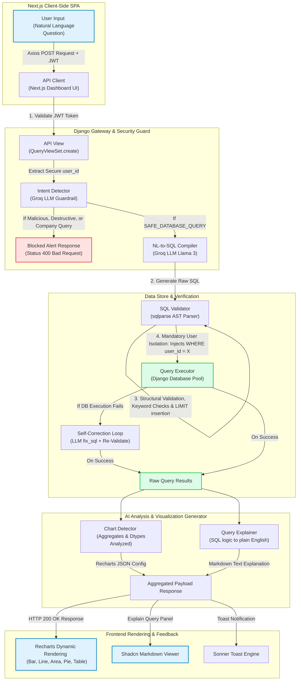

# 📊 Text-SQL-Assistant: Architecture & Features Guide

Welcome to the comprehensive architecture and systems manual for the **Text-SQL-Assistant**. This guide details how the application works from the user interface down to the database level, detailing the request lifecycle, the multi-tenant security architecture, and the modular services of the platform.

---

## 1. 🔄 Request Lifecycle Flowchart

Below is the visual blueprint of how a user's question is parsed, secured, compiled, executed, and visualized.



---

## 2. 🏛️ Core Architecture Deep-Dive

The project is structured as a modern **Decoupled Single Page Application (SPA)** with a Python-based intelligent backend.

### 🖥️ Next.js Frontend (TypeScript & React)
*   **Routing & Views**: Uses Next.js App Router. The core workspace is located in `frontend/src/app/dashboard`.
*   **State Store**: Zustand manages all persistent and transient states:
    *   `authStore.ts`: Tracks active JWTs and user profiles. Wipes all stores upon logout.
    *   `queryStore.ts`: Caches query results, dynamic visualizations, and current charts.
    *   `conversationStore.ts`: Manages active conversation threads and histories.
*   **Visualization Engine**: Powered by **Recharts**, drawing customized, responsive SVG charts with premium dark-mode styling.
*   **Styling**: Customized Vanilla CSS and Tailwind variables producing a sleek glassmorphic aesthetics.

### 🐍 Django REST Framework Backend
*   **API Gateway**: Exposes highly clean REST API controllers (`views.py` in `sql_assistant` app) that enforce robust token authorization using custom validation algorithms.
*   **Model Layer**: Uses SQLite as the default target DB. Models are divided into:
    *   **Core Systems**: `QueryHistory` (storing prompt inputs, SQL answers, safety reports, visual logs), `ConversationSession` (storing threads).
    *   **Dummy E-Commerce Models**: `Customer`, `Product`, `Order`, `OrderItem`, and `Review` under the `ecommerce` package.
*   **Intelligent Services**: Under `sql_assistant/services/`, the backend runs highly decoupled Python microservices coordinating the AI pipelines.

---

## 3. 🛡️ The Double-Layer Security Shield (The "How-It-Works" Guide)

Securing a text-to-SQL system is notoriously difficult because standard LLMs can easily be tricked or hijacked into executing bad commands. We built an air-tight, dual-layer security shield to block all vectors of attack.

### 🛑 Layer 1: Pre-Execution Intent Detection (`intent_detector.py`)
Before compiling *any* SQL query, the raw input question is sent to the `IntentDetector` running Meta Llama-3 with a zero-temperature JSON-enforced structure. 

It classifies the user's intent into exactly one category:
1.  `SAFE_DATABASE_QUERY`: Standard reading/aggregating operations.
2.  `DESTRUCTIVE_QUERY`: User trying to run commands like `DROP`, `DELETE`, `UPDATE`, `INSERT`, `ALTER`, or `TRUNCATE`.
3.  `NON_DATABASE_QUERY`: Conversational questions or requests for coding advice (e.g. *"What is the weather?"*, *"Write a python script to hack a website"*).
4.  `PROMPT_INJECTION`: User attempting to override system prompts or force the bot to print secret tokens.
5.  `COMPANY_DATA_QUERY`: User trying to fetch metrics belonging to other users or query global metrics (e.g. *"What is the total company revenue?"* or *"Show me User 4's top customers"*).

> [!IMPORTANT]
> If the `IntentDetector` output is **anything** other than `SAFE_DATABASE_QUERY`, the request is **blocked immediately**. A safe error code is written to `QueryHistory`, and the server returns a `400 Bad Request` to the user, stopping the request before any code is generated.

### 🛡️ Layer 2: Abstract Syntax Tree (AST) Parsing & SQL Validation (`sql_validator.py`)
If the intent is marked safe, the LLM translates the query. The generated SQL must then pass the `SQLValidator` to ensure complete system safety.

#### 1. SQL Structure & Token Validation
We parse the SQL code using the programmatic compiler library `sqlparse` to decompose the statement.
```python
parsed = sqlparse.parse(clean_sql)
statement = parsed[0]
if statement.get_type() != 'SELECT':
    return fail('Only SELECT queries are allowed')
```
This forces all inputs to be read-only and blocks stacked commands separated by a semicolon (preventing classic SQL Injection).

#### 2. Automatic User Data Isolation Injection
This is the most critical component. Since users are only allowed to see their own products, customers, and orders, every query must be filtered by their current ID. If the LLM generates a clean query but omits the `user_id` constraint, our validator **actively rewrites the SQL** to force it.

The validator matches tables against a pre-registered list of user-scoped tables:
```python
USER_SCOPED_TABLES = {'customers', 'products', 'orders', 'reviews'}
```
It extracts all tables and aliases from the query (e.g., `FROM orders AS o` -> table: `orders`, alias: `o`). It then checks if `o.user_id = <user_id>` is present in the `WHERE` clause. If not, it programmatically injects it:
```python
# If WHERE clause exists
where_match = re.search(r'\bWHERE\b', sql, re.IGNORECASE)
if where_match:
    # Inject after WHERE as an AND condition
    insert_pos = where_match.end()
    sql = sql[:insert_pos] + f" {alias}.user_id = {user_id} AND" + sql[insert_pos:]
else:
    # Inject standard WHERE clause before ORDER BY or LIMIT
    sql += f" WHERE {alias}.user_id = {user_id}"
```
This guarantees that **no query can ever execute on the database without being sandboxed to the active user's ID.**

---

## 4. 🚀 Feature Matrix: Features & Implementations

| Feature | Simple Explanation | Technical Implementation Details |
| :--- | :--- | :--- |
| **Natural Language to SQL** | Type a plain question, get database data back. | Frontend uses Axios to post the question. Django queries `SchemaInspector` for database metadata, formats it as context, sends to Groq API, and retrieves clean SQLite SQL syntax. |
| **Multi-Tenant Isolation** | User A sees User A's data only; User B sees User B's data only. | Registration triggers `UserDataSeeder` to write fake data rows belonging to that specific user ID. The backend extracts `user_id` from secure JWTs and enforces/injects it using `sqlparse` AST parsing. |
| **Safety & Intent Guard** | Blocks malicious hacking, deletes, modifications, and off-topic queries. | Pre-execution `IntentDetector` blocks bad prompts via LLM analysis. Post-generation `SQLValidator` screens SQL keywords (`UNION SELECT`, `UPDATE`, `DROP`), stacked queries, and auto-appends `LIMIT 100`. |
| **Self-Correction Pipeline** | Typo correction & SQL syntax healing on execution. | Database execution is wrapped in a Python `try-except`. On crash, the SQL + traceback error is piped to the Groq LLM `fix_sql` method. The corrected query is re-validated and executed seamlessly. |
| **Dynamic Visualizations** | System picks the best chart (Bar, Line, Area, Pie, Table) and shows beautiful graphs. | `ChartDetector` service reviews rows, data types, and aggregates. Outputs dynamic configurations parsed by the Next.js frontend using the responsive **Recharts** engine. |
| **Interactive Explorer** | Users can inspect their active tables, columns, relations, and preview data. | `SchemaInspector` builds relational structures from live database metadata. Exposes preview endpoints with automated `user_id` filtering. |
| **Session Threading & Favorites** | Thread history and bookmarks for active questions. | `ConversationManager` maintains database threads using the `QueryHistory` model. CRUD routes let users save queries, delete sessions, and star favorites. |
| **CSV/Excel Exports** | Download any chart or query results table. | `ExportEngine` processes rows through native `csv` and `openpyxl` packages to export live byte streams directly through API responses. |
| **UI Polishing & Cleanup** | Modern aesthetics, responsive layouts, no dead code, crisp feedback. | Configured Sonner `Toaster` for modern notifications, cleaned up dead UI (the notification bell), and implemented robust Zustand store clear-outs upon logout to eliminate state leakage. |

---

## 5. 🛠️ How to Extend This Project

If you want to add new capabilities to this workspace, here is where to look:

1.  **To add a new table to the user sandbox:**
    *   Create the Django Model in `backend/ecommerce/models.py`.
    *   Add the table name to `USER_SCOPED_TABLES` inside [backend/sql_assistant/services/sql_validator.py](file:///d:/PROGRAMMING/ET%20Projects/Text-SQL-Assistant/backend/sql_assistant/services/sql_validator.py).
    *   Add appropriate seed parameters to `UserDataSeeder` in [backend/sql_assistant/services/seed_user_data.py](file:///d:/PROGRAMMING/ET%20Projects/Text-SQL-Assistant/backend/sql_assistant/services/seed_user_data.py).

2.  **To adjust AI prompts:**
    *   Modify the SQL generation guidelines in [backend/sql_assistant/services/nl_to_sql.py](file:///d:/PROGRAMMING/ET%20Projects/Text-SQL-Assistant/backend/sql_assistant/services/nl_to_sql.py).
    *   Modify safety definitions in [backend/sql_assistant/services/intent_detector.py](file:///d:/PROGRAMMING/ET%20Projects/Text-SQL-Assistant/backend/sql_assistant/services/intent_detector.py).

3.  **To build a new chart visualization type:**
    *   Add parsing logic in [backend/sql_assistant/services/chart_detector.py](file:///d:/PROGRAMMING/ET%20Projects/Text-SQL-Assistant/backend/sql_assistant/services/chart_detector.py).
    *   Map the chart configuration to a React Component in `frontend/src/components/dashboard/ChartView.tsx`.

---
*Document compiled and maintained inside the workspace by Antigravity AI.*
